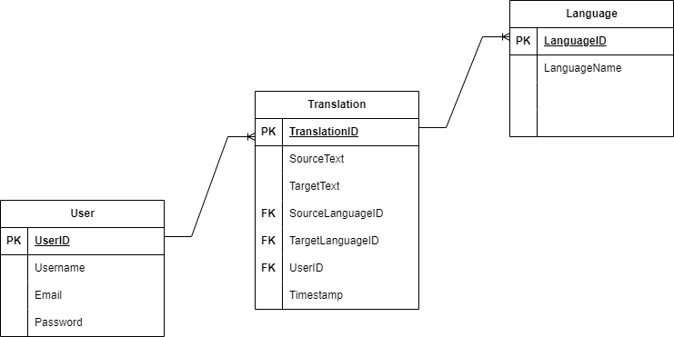

1. **Identification of the problem you are trying to solve by building this particular app.**  
- The problem I'm trying to solve with this app is a language barrier problem. Swahili is widely spoken language in East Africa. Recently, East Africa has been attracting a lot of foreigners in terms of tourism and business. This is where my app comes into play, it would be useful for these foreigners to have a Swahili translator while they go about their business.  
2. **Why is it a problem that needs solving?**  
- It is a problem that needs solving because there would be no proper way for people to connect with a language barrier in place. People understand each other better if there is good communication. Solving the problem would bring along a lot of benefits such as, better communication, efficient business dealings and better connections between people.  
3. **Why have you chosen this database system. What are the drawbacks compared to others?**  
- For this app I have chosen a RDMS, PostgreSQL for these reasons; It provides a reliable and structured way to store and retrieve data, making it a suitable option for complex data models and relationships. PostgreSQL can handle large amounts of data and and high concurrent user access efficiently. Another reason why I chose it, is because it allows the creation of custom data types, functions and extensions.  
- However, PostgreSQL can be more complex to set up and manage compared to light-weight databases like SQLite. It requires more configuration including user management and permissions settings.Another drawback is that PostgreSQL may require more system resources in terms of memory and processing power.  
4. **Identify and discuss the key functionalities and benefits of an ORM**  
- Object-Relational Mapping(ORM) is a programming technique that allows developers to interact with a relational database using object-oriented paradigms.
- **Object-Oriented Paradigm**- ORM bridges the gap between object-oriented programming languages and relational databases. It makes it easier to model and manipulate data.  
- **Data Modelling and Relationships**- ORM frameworks provide tools to define data models and relationships between entities in the database. A benefit of this is developers can define classes and their attributes and entity relationships.  
- **Querying Language**- ORM frameworks provide query languages that allow developers to retrieve data from the database using high-level, object-oriented syntax.  
- **Perfomance Optimization**- Many ORM frameworks include features for performance optimization, such as lazy loading, eager loading and caching.  
5. **Document all endpoints for your API**  
A. **Endpoint:** **'/translate'**  
- **Method:** POST  
- **Description:** Translates the provided text from the source language to the target language.  
- **Request Body:** {  
  "source_text": "Text to be translated",  
  "source_language": "en",  
  "target_language": "sw"  
}  
- **Response:** {  
  "translated_text": "Translated text"  
}  
B. **Endpoint:** **'/languages'**  
- **Method:** GET  
- **Description:** Retrieves the list of supported languages for translation.  
- **Response:** {  
  "languages:" [  
    {  
      "language_id": "en",  
      "language_id": "sw"  
    }  
  ]  
}  
6. **An ERD for your app**  
  
7. **Detail any third party services that your app will use**  
- Google Cloud Translation API is a third party service that I used in the app. The API offers a powerful machine learning-based translation service. It provides a wide range of translation capabilities such as language detection and also languag-specific features. The API is integrated into the app through a process which involves; setting up a Google Cloud account, enabling the Translation API, installing the Google Cloud Client Library, Authentication, importing the library and lastly performing translations.  
8. **Describe your projects models in terms of the relationships they have with each other**  
- A **Translation** is associated with a **Language** as both the source language and target language are represented by language codes. This represents a many-to-one relationship between the Translation entity and the Language entity. Multiple translations can have the same source or target language, but each translation is linked to a specific language.  
9. **Discuss the database relations to be implemented in your application**  
A. **Translation and Language:**  
- One-to-Many Relationship: Each Language can be associated with multiple Translations, while each Translation is linked to a single Language.  
- Foreign Key: The Translation entity can have a foreign key attribute, such as 'language_id', referencing the primary key of the Language entity.  
B. **User and Translation:**  
- One-to-Many Relationship: Each User can perform multiple Translations, while each translation is associated with a single User.  
- Foreign Key: The Translation entity can have a foreign key attribute, such as 'user_id', referencing the primary key of the User entity.  
10. **Describe the way tasks are allocated and tracked in your project**  
A. **Task Allocation:**  
- Developing a software plan  
- Identifying the components and features of the API  
- Breaking down the tasks into smaller manageable units  
- Having a logical flow for getting the tasks done step by step  
B. **Task Tracking:**  
- I used a project management tool called 'Monday' to track the progress of my project.  
- Each task had a clear description, difficulty level and estimated due date.  
- The project management tool helped me track the progress of each individual task. I would regularly update the tasks depending if it was "in progress" or "completed"  
C. **Version Control:**  
- At the start of the project, I used a local repository to save and make changes to the project. However, I switched to using a Git remote repository to manage the project. Regular commits were made to the repository.  
D. **Testing:**  
- This was an ongoing task throughout the project. I tested all the API endpoints to make sure they are working as expected. I also implemented error handling features in the API.